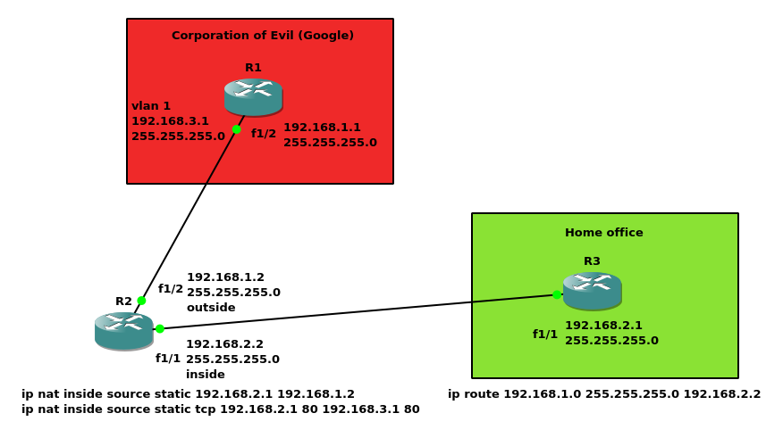

# LAB5 - GNS3

- [Network](#network)
- [R1](#r1)
- [R2](#r2)
- [R3](#r3)

## Network



## R1

```
!
!

!
version 12.4
service timestamps debug datetime msec
service timestamps log datetime msec
no service password-encryption
!
hostname R1
!
boot-start-marker
boot-end-marker
!
!
no aaa new-model
memory-size iomem 5
no ip icmp rate-limit unreachable
ip cef
!
!
!
!
no ip domain lookup
ip auth-proxy max-nodata-conns 3
ip admission max-nodata-conns 3
!
!
!
!
!
!
!
!
!
!
!
!
!
!
!
!
!
!
!
ip tcp synwait-time 5
!
!
!
!
!
interface FastEthernet0/0
 no ip address
 shutdown
 duplex auto
 speed auto
!
interface FastEthernet0/1
 no ip address
 shutdown
 duplex auto
 speed auto
!
interface FastEthernet1/0
!
interface FastEthernet1/1
!
interface FastEthernet1/2
 no switchport
 ip address 192.168.1.1 255.255.255.0
!
interface FastEthernet1/3
!
interface FastEthernet1/4
!
interface FastEthernet1/5
!
interface FastEthernet1/6
!
interface FastEthernet1/7
!
interface FastEthernet1/8
!
interface FastEthernet1/9
!
interface FastEthernet1/10
!
interface FastEthernet1/11
!
interface FastEthernet1/12
!
interface FastEthernet1/13
!
interface FastEthernet1/14
!
interface FastEthernet1/15
!
interface Vlan1
 ip address 192.168.3.1 255.255.255.0
!
ip forward-protocol nd
!
!
no ip http server
no ip http secure-server
!
no cdp log mismatch duplex
!
!
!
control-plane
!
!
!
!
!
!
!
!
!
!
line con 0
 exec-timeout 0 0
 privilege level 15
 logging synchronous
line aux 0
 exec-timeout 0 0
 privilege level 15
 logging synchronous
line vty 0 4
 login
!
!
end
```

## R2

```
!
!

!
version 12.4
service timestamps debug datetime msec
service timestamps log datetime msec
no service password-encryption
!
hostname R2
!
boot-start-marker
boot-end-marker
!
!
no aaa new-model
memory-size iomem 5
no ip icmp rate-limit unreachable
ip cef
!
!
!
!
no ip domain lookup
ip auth-proxy max-nodata-conns 3
ip admission max-nodata-conns 3
!
!
!
!
!
!
!
!
!
!
!
!
!
!
!
!
!
!
!
ip tcp synwait-time 5
!
!
!
!
!
interface FastEthernet0/0
 no ip address
 shutdown
 duplex auto
 speed auto
!
interface FastEthernet0/1
 no ip address
 shutdown
 duplex auto
 speed auto
!
interface FastEthernet1/0
!
interface FastEthernet1/1
 no switchport
 ip address 192.168.2.2 255.255.255.0
 ip nat inside
 ip virtual-reassembly
!
interface FastEthernet1/2
 no switchport
 ip address 192.168.1.2 255.255.255.0
 ip nat outside
 ip virtual-reassembly
!
interface FastEthernet1/3
!
interface FastEthernet1/4
!
interface FastEthernet1/5
!
interface FastEthernet1/6
!
interface FastEthernet1/7
!
interface FastEthernet1/8
!
interface FastEthernet1/9
!
interface FastEthernet1/10
!
interface FastEthernet1/11
!
interface FastEthernet1/12
!
interface FastEthernet1/13
!
interface FastEthernet1/14
!
interface FastEthernet1/15
!
interface Vlan1
 no ip address
!
ip forward-protocol nd
!
!
no ip http server
no ip http secure-server
ip nat inside source static 192.168.2.1 192.168.1.2
ip nat inside source static tcp 192.168.2.1 80 192.168.3.1 80 extendable
!
no cdp log mismatch duplex
!
!
!
control-plane
!
!
!
!
!
!
!
!
!
!
line con 0
 exec-timeout 0 0
 privilege level 15
 logging synchronous
line aux 0
 exec-timeout 0 0
 privilege level 15
 logging synchronous
line vty 0 4
 login
!
!
end
```

## R3

```
!
!
!
!

!
version 12.4
service timestamps debug datetime msec
service timestamps log datetime msec
no service password-encryption
!
hostname R3
!
boot-start-marker
boot-end-marker
!
!
no aaa new-model
memory-size iomem 5
no ip icmp rate-limit unreachable
ip cef
!
!
!
!
no ip domain lookup
ip auth-proxy max-nodata-conns 3
ip admission max-nodata-conns 3
!
!
!
!
!
!
!
!
!
!
!
!
!
!
!
!
!
!
!
ip tcp synwait-time 5
!
!
!
!
!
interface FastEthernet0/0
 no ip address
 shutdown
 duplex auto
 speed auto
!
interface FastEthernet0/1
 no ip address
 shutdown
 duplex auto
 speed auto
!
interface FastEthernet1/0
!
interface FastEthernet1/1
 no switchport
 ip address 192.168.2.1 255.255.255.0
!
interface FastEthernet1/2
!
interface FastEthernet1/3
!
interface FastEthernet1/4
!
interface FastEthernet1/5
!
interface FastEthernet1/6
!
interface FastEthernet1/7
!
interface FastEthernet1/8
!
interface FastEthernet1/9
!
interface FastEthernet1/10
!
interface FastEthernet1/11
!
interface FastEthernet1/12
!
interface FastEthernet1/13
!
interface FastEthernet1/14
!
interface FastEthernet1/15
!
interface Vlan1
 no ip address
!
ip forward-protocol nd
ip route 192.168.1.0 255.255.255.0 192.168.2.2
!
!
no ip http server
no ip http secure-server
!
no cdp log mismatch duplex
!
!
!
control-plane
!
!
!
!
!
!
!
!
!
!
line con 0
 exec-timeout 0 0
 privilege level 15
 logging synchronous
line aux 0
 exec-timeout 0 0
 privilege level 15
 logging synchronous
line vty 0 4
 login
!
!
end
```
